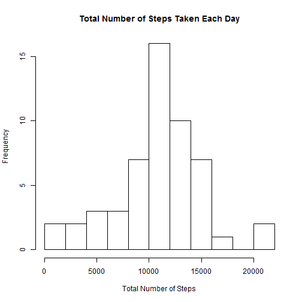
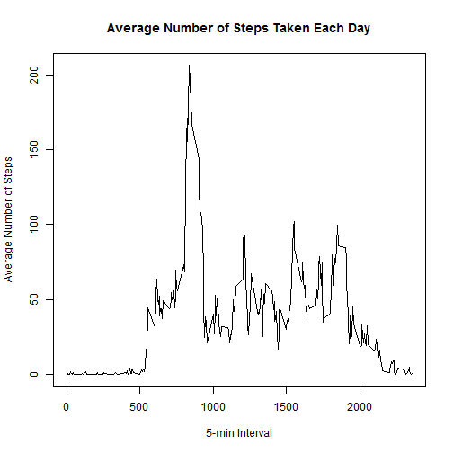
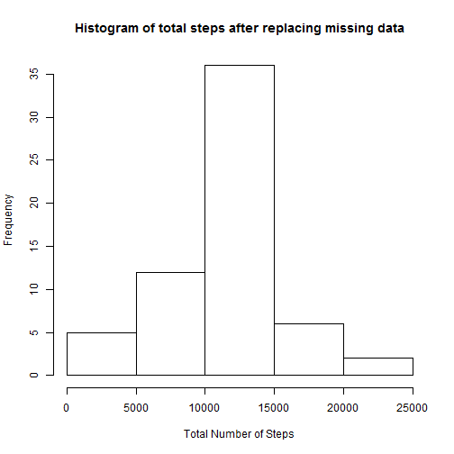
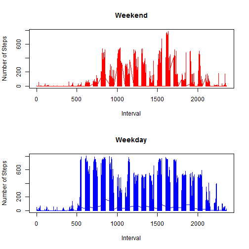

# Reproducible Research: Peer Assessment 1

## Loading and preprocessing the data

```r
t = read.csv("activity.csv")
t[, 2] = as.Date(t[, 2])
```


## What is mean total number of steps taken per day?

```r
x = complete.cases(t)
sm = aggregate(steps ~ date, t[x, ], sum)
men = aggregate(steps ~ date, t[x, ], mean)
med = aggregate(steps ~ date, t[x, ], median)
hist(sm[, 2], 10, xlab = "Total Number of Steps", ylab = "Frequency", main = "Total Number of Steps Taken Each Day")
```

 

Mean and Median Number of Steps Taken Each Day

```r
output = merge(mean(sm[, 2]), median(sm[, 2]))
names(output) = c("Mean Steps", "Median Steps")
print(output)
```

```
##   Mean Steps Median Steps
## 1      10766        10765
```


## What is the average daily activity pattern?

```r
sm = aggregate(steps ~ interval, t, mean)
plot(sm[, 1], sm[, 2], type = "l", xlab = "5-min Interval", ylab = "Average Number of Steps", 
    main = "Average Number of Steps Taken Each Day")
```

 


The 5-minute interval with the maximium number of steps

```r
print(sm[which.max(sm[, 2]), ])
```

```
##     interval steps
## 104      835 206.2
```


## Imputing missing values

The total number of rows with missing data

```r
print(paste("missing cases:", sum(!complete.cases(t))))
```

```
## [1] "missing cases: 2304"
```


The strategy for filling in all of the missing values is to replace the missing values with the mean for that 5-minute interval. 'r' is the new dataset that is equal to the original dataset 'p' but with the missing data filled in. 

```r
p = tapply(t$steps, t$interval, mean, na.rm = TRUE)
r = t
for (i in 1:length(p)) {
    r[r$interval == as.numeric(names(p)[i]) & is.na(r$steps), 1] = p[i]
}
```


After replacing the missing data, the mean remains the same but the median increases by 1.  

```r
sm2 = aggregate(steps ~ date, r, sum)
hist(sm2[, 2], main = "Histogram of total steps after replacing missing data", 
    xlab = "Total Number of Steps")
```

 

```r

output = merge(mean(sm2[, 2]), median(sm2[, 2]))
names(output) = c("Mean Steps", "Median Steps")
print(output)
```

```
##   Mean Steps Median Steps
## 1      10766        10766
```

## Are there differences in activity patterns between weekdays and weekends?

```r
r[, 4] = weekdays(r$date)
q = r[, 4]
q[r[, 4] == "Sunday" | r[, 4] == "Saturday"] = "Weekend"
q[r[, 4] != "Sunday"] = "Weekday"
r[, 4] = factor(q)

r = r[order(r$interval), ]
par(mfrow = c(2, 1))
plot(r$interval[r[, 4] == "Weekend"], r$steps[r[, 4] == "Weekend"], type = "l", 
    col = "red", xlab = "Interval", ylab = "Number of Steps", main = "Weekend")
plot(r$interval[r[, 4] == "Weekday"], r$steps[r[, 4] == "Weekday"], type = "l", 
    col = "blue", xlab = "Interval", ylab = "Number of Steps", main = "Weekday")
```

 


